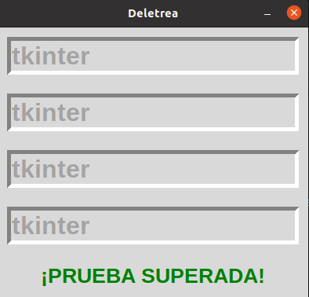
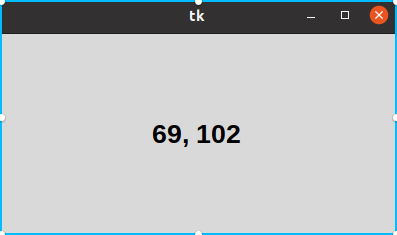
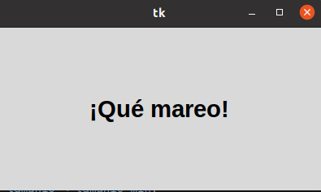

# 2. METODOS COMUNES
## Deletreo
### Este programa trata sobre completar la palabra en cada una de las celdas en las que se rota aleatoriamente.

# Posicion de Raton
## Permite saber la posicion exacta del cursor del mouse.

# Temporizadores
## Con este método se puede aumentar y disminuir el tamaño del texto de manera continua hasta no cerrar la ventana.

