# WIDGETS
## Cronómetro
### Permite contabilizar el tiempo

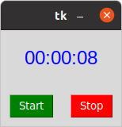

# Inicio de sesión 
## Acceder a la cuenta

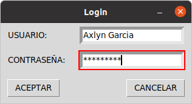

# Reloj 
## Programa la saber la hora

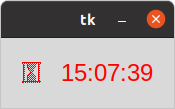

# Traductor 
## Consiste en introducir una palabra y este programa con varias opciones de idiomas para escoger, la traduce según la opción de preferencia

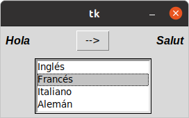

# Menú 
## Ventana con varias opciones.

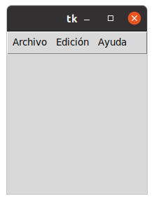

# Mensaje de información 
## Porporciona un mensaje cuando se quiere mirar "acerca de..." y "manuel de usuario"

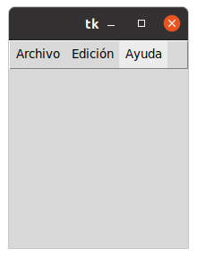

# Ángulo
## Dibuja el ángulo según lo indique.

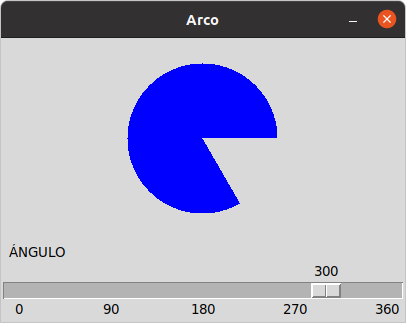

# Formulario 1 
## Permite llenar un pequeño fomulario, pocas opciones

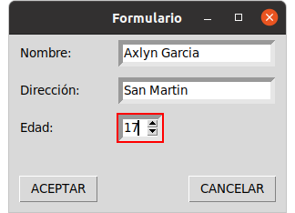

# Formulario 2 
## Permite llenar un formulario con más opciones

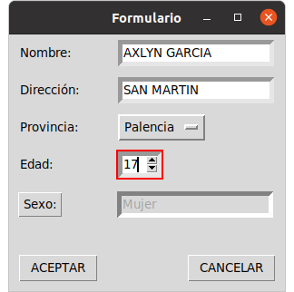

# Editor de texto
## Permite escribir un texto 

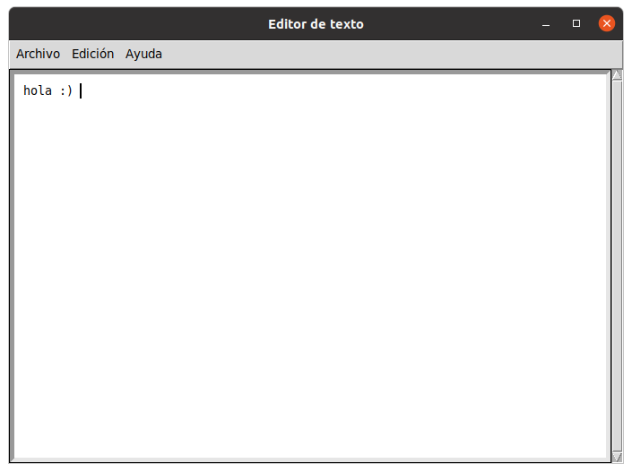

# Editor de texto 2 
## Permite editar el etxto y guardarlo

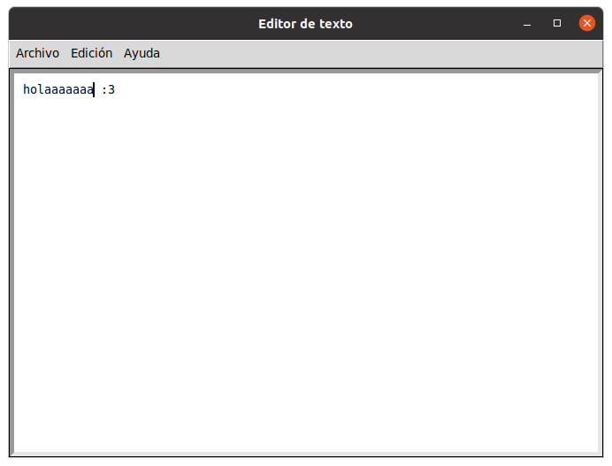

